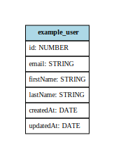

# Techo Hiring API

At the moment this is a boilerplate based on Typescript, Express, Sequelize and OpenApi, you can replace this paragraph to add a description to your application

---

## Quick Start

- The first thing would be to copy the `.env.example` file to a `.env` file and configure it as needed
- Then Install the dependencies with this comand: `yarn`
- Then create the database: `yarn sequelize-cli db:create`

Get started developing...

```shell
# install deps
yarn

# run development mode
yarn dev

# run tests
yarn test
```

Run the production mode

```shell
# install deps
yarn

# transpile de code
yarn build

# run production mode
yarn start

```

---

## Scripts:

| Script                   | Description                                                                                                                                      |
| ------------------------ | ------------------------------------------------------------------------------------------------------------------------------------------------ |
| `yarn dev`               | Runs the server on development mode.                                                                                                             |
| `yarn build`             | Creates the build in the **dist** folder to be run later (also runs `yarn clean` and `yarn copy-files`).                                         |
| `yarn start`             | Runs the build in production mode, must have previously run `yarn build`.                                                                        |
| `yarn test`              | Runs the automated tests (In test environment).                                                                                                  |
| `yarn mocha`             | Runs the automated tests (Without test environment).                                                                                             |
| `yarn lint`              | Runs the linter `eslint` checking if the code complies with the formatting rules (run preferably before each commit).                            |
| `yarn lint:fix`          | Runs the linter `eslint` checking and fixing the formatting rules (it may not correct everything).                                               |
| `yarn prettier`          | Runs `prettier` formatting all files (run preferably before each commit).                                                                        |
| `yarn db:erd`            | Updates de Entity relationship diagram image                                                                                                     |
| `yarn db:makemigrations` | Create the remaining migrations since the last time this script was run (by comparison between the current sequelice models and `_curren.json`). |
| `yarn db:migrate`        | Runs all migrations                                                                                                                              |
| `yarn db:seed`           | Runs all seeders                                                                                                                                 |
| `yarn db:reset`          | Resets the database by dropping it, creating it and executing the migrations(the config is taken from `.sequelizerc`)                            |
| `yarn clean`             | Deletes the **dist** folder where the built files are stored.                                                                                    |
| `yarn copy-files`        | Copy all files with extensions `.yml`, `.json`, `.png`, `.html`, `.css`, `.js`, `.map` to the buid in the **dist** folder.                       |

---

## Entity relationship diagram:



---
